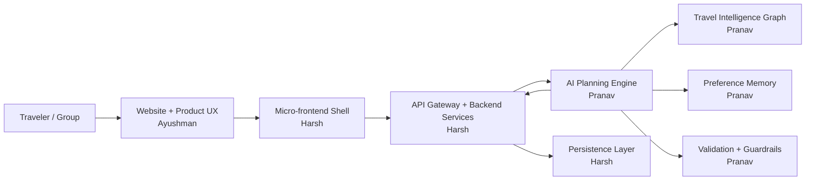
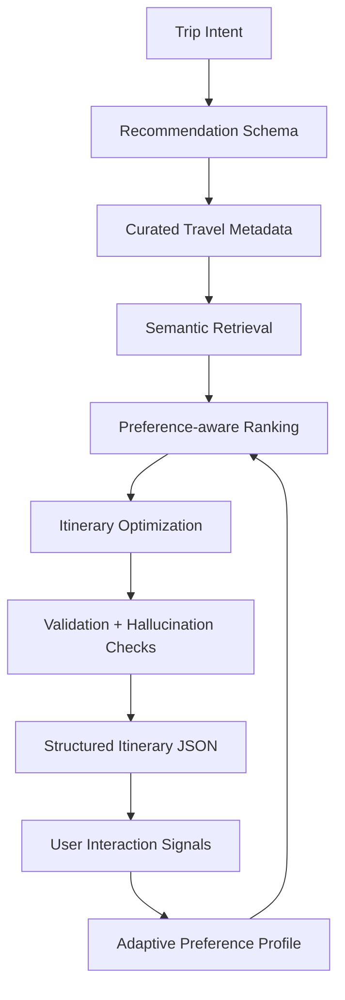

<div align="center">

# WayFinder

### AI-assisted group travel planning that learns how people actually travel.

[](#)
[](#)
[](LICENSE)
[](https://github.com/PRRanavvv/WayFinder-Labs)

</div>

WayFinder-Labs is the main public repository for WayFinder from this point onward.

WayFinder is an AI-powered group travel planning platform built around semantic itinerary generation, collaborative spatial planning, and adaptive preference intelligence. The public repo is structured to show the product architecture and safe demo logic while keeping private datasets, proprietary ranking heuristics, production prompts, and internal experiments out of scope.

---

## Team Roles

| Member | Role | Primary Ownership | Repo Boundary |
| --- | --- | --- | --- |
| Harsh | Frontend Architecture / Backend Infrastructure / System Integration Lead | Micro-frontend shell, shared frontend architecture, backend services, Prisma + PostgreSQL setup, auth, API gateway, deployment, monitoring, CI/CD | Owns frontend, backend, infrastructure, and system integration changes. |
| Pranav | AI Systems / Product Intelligence Lead | AI architecture, recommendation schemas, travel metadata intelligence, structured prompting, retrieval, ranking, adaptive memory, optimization, validation | Adds public-safe AI/ML work only: `ai-engine/`, AI docs, schemas, safe demo data, scoring demos, and evaluation examples. |
| Ayushman | Product / Website Designer | Website design, planning workspace UX, design system, landing experience, visual assets, Figma/spec handoff | Owns design direction and assets; implementation should be coordinated through frontend branches. |

## Contribution Rule From Here Onward

This repo remains the main team MVP repo, but Pranav-side additions should follow a strict AI/ML-only boundary.

Allowed for Pranav's workstream:

- AI system architecture docs
- Recommendation schemas
- Public-safe metadata examples
- Structured generation and validation logic
- Retrieval/ranking demos
- Adaptive scoring examples
- Evaluation scripts using safe or synthetic data

Not allowed in the public repo:

- Private Jaipur intelligence datasets
- Production prompts or vendor orchestration internals
- Proprietary scoring weights or ranking heuristics
- Secrets, credentials, dumps, binaries, or private experiments

## Product Aim

Most itinerary apps generate static lists. WayFinder is designed around a different idea:

> Travel planning should feel like co-designing a journey with an intelligent assistant.

WayFinder turns trip planning into a visual workspace where activities can be arranged, evaluated semantically, adapted to group behavior, and explained in human terms.

## MVP Architecture



## AI/ML Pipeline



## Product Highlights

- Collaborative planning canvas for arranging itinerary nodes across day swimlanes
- Semantic place graph with clusters, roles, fatigue, weather fit, and routing context
- AI copilot surface for route, pacing, and recovery recommendations
- Adaptive preference memory that learns from edits, pins, replacements, and accepted suggestions
- Explainable itinerary generation lifecycle
- Public-safe AI engine demo with semantic ranking and preference-aware scoring
- Startup-style architecture docs for recruiters, reviewers, and collaborators

## Repository Structure

```text
WayFinder-Labs/
|-- frontend/          # Public showcase React UI
|-- backend/           # Public-safe API shell
|-- ai-engine/         # Public-safe AI planning logic and demos
|-- docs/              # Architecture, roadmap, and AI/ML documentation
|-- assets/            # Screenshots, diagrams, and design assets
|-- .github/           # Issue and PR templates
|-- CONTRIBUTING.md
|-- SECURITY.md
`-- README.md
```

## Strict AI/ML Build Order

| Week | Main Focus | Pranav AI/ML Scope | Public-Safe Deliverable |
| --- | --- | --- | --- |
| Week 1 | Core System and Architecture Design | Finalize AI system architecture, recommendation schemas, curated travel metadata system, scoring parameter planning | AI architecture docs and schema plan |
| Week 2 | Frontend-Backend Integration and AI Generation Layer | Build structured prompting pipeline, JSON output enforcement, itinerary generation logic, validation systems, prompt experimentation | Structured itinerary generation contract |
| Week 3 | Interactive Visualization and Intelligence Layer | Build curated travel dataset, metadata tagging, travel intelligence categorization system | Safe sample metadata model |
| Week 4 | Retrieval Infrastructure and Performance Layer | Set up embeddings pipeline, vector DB integration, semantic retrieval system, contextual retrieval testing | Retrieval architecture and demo flow |
| Week 5 | Recommendation and Optimization Engine | Build recommendation ranking engine, budget scoring logic, travel efficiency optimization, preference balancing logic | Public-safe ranking and scoring demo |
| Week 6 | AI Orchestration and Infrastructure Layer | Integrate retrieval + ranking + LLM orchestration pipeline, dynamic itinerary recalculation system, reasoning refinement | End-to-end AI planning pipeline demo |
| Week 7 | Optimization and Reliability Layer | Add hallucination reduction system, itinerary optimization engine, recommendation validation pipeline, route balancing logic | Reliability and validation layer |
| Week 8 | Production Launch Phase | AI tuning, dataset expansion, recommendation quality refinement, feedback-driven optimization | Launch-ready public AI/ML showcase |

Full AI/ML implementation order: [docs/AIML_IMPLEMENTATION_ORDER.md](docs/AIML_IMPLEMENTATION_ORDER.md).

## Documentation

- [System Design](docs/SYSTEM_DESIGN.md)
- [AI Pipeline Flow](docs/AI_PIPELINE_FLOW.md)
- [Ranking Engine](docs/RANKING_ENGINE.md)
- [Itinerary Lifecycle](docs/ITINERARY_LIFECYCLE.md)
- [Adaptive Memory Lifecycle](docs/ADAPTIVE_MEMORY_LIFECYCLE.md)
- [AIML Implementation Order](docs/AIML_IMPLEMENTATION_ORDER.md)
- [Public Repository Scope](docs/PUBLIC_REPO_SCOPE.md)

## Tech Stack

| Layer | Technology |
| --- | --- |
| Frontend | React, Vite, CSS |
| Backend | Node.js, Express |
| AI Engine | JavaScript modules, semantic scoring demo, structured JSON contracts |
| Data Layer | Public-safe sample data, private production data excluded |
| Documentation | Markdown, Mermaid architecture diagrams |

## Local Setup

```bash
git clone https://github.com/PRRanavvv/WayFinder-Labs.git
cd WayFinder-Labs
npm install
```

Run frontend:

```bash
npm run dev --workspace frontend
```

Run backend:

```bash
npm run dev --workspace backend
```

Run AI engine demo:

```bash
npm run demo:ai
```

## Public Scope

This repository does not include:

- Production secrets or environment variables
- MongoDB data, binaries, dumps, or lock files
- Raw proprietary datasets
- Internal ranking heuristics
- Vendor prompts or model orchestration internals
- Private experiments, research PDFs, or generated artifacts

See [Public Repository Scope](docs/PUBLIC_REPO_SCOPE.md).

## Contributing

This is now the main public MVP repo for the WayFinder team. Contributions should stay aligned with the ownership boundaries above.

Read [CONTRIBUTING.md](CONTRIBUTING.md).

## Team

Built by the WayFinder team: Harsh, Pranav, and Ayushman.
