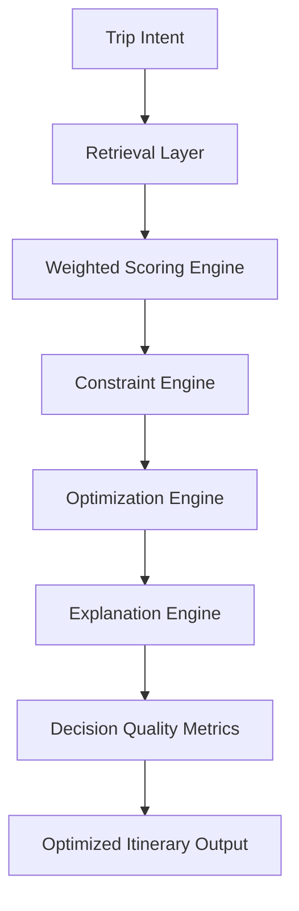

# Decision Quality Layer

Priority 3 turns WayFinder from retrieval plus ranking into an explainable travel decision engine.

The goal is not to make an LLM produce nicer itinerary text. The goal is to produce better decisions before any natural-language generation happens.

## Core Principle

```text
Retrieval finds candidates.
Scoring ranks candidates.
Constraints decide feasibility.
Optimization builds a realistic plan.
Explanation exposes why decisions were made.
Evaluation measures decision quality.
```

## Current Architecture



## Implemented Modules

| Module | File | Purpose |
| --- | --- | --- |
| Scoring config | `ai-engine/src/intelligence/scoringConfig.js` | Configurable scoring dimensions and profiles |
| Scoring engine | `ai-engine/src/intelligence/scoringEngine.js` | Weighted candidate scoring, confidence, score contributions |
| Constraint engine | `ai-engine/src/intelligence/constraintEngine.js` | Budget, timing, fatigue, flow, meal, weather, and group checks |
| Optimization engine | `ai-engine/src/intelligence/optimizationEngine.js` | Greedy deterministic scheduling with transition penalties |
| Explanation engine | `ai-engine/src/intelligence/explanationEngine.js` | User-facing reasoning and decision traces |
| Evaluation metrics | `ai-engine/src/intelligence/evaluationMetrics.js` | Ranking, optimization, feasibility, and explainability metrics |

## Constraint Coverage

Current public-safe constraints include:

- hard daily budget cap
- soft budget warning threshold
- daily fatigue limit based on energy level
- consecutive high-fatigue prevention
- activity role/type repetition warnings
- opening/day-window compatibility
- meal slot fit
- weather suitability
- group compatibility

## Optimization Coverage

The current optimizer uses deterministic heuristics:

- ranked candidate quality
- constraint feasibility
- slot fit
- transition-time penalty
- budget and fatigue balance
- activity flow warnings

This is intentionally simple enough to run locally and explain clearly. Future production versions can move advanced optimization experiments to Python and OR-Tools.

## Run

```bash
npm run demo:decision-quality
npm run test:decision-quality
```

## What The LLM Should Do Later

Allowed LLM responsibilities:

- structure final itinerary copy
- explain deterministic decisions naturally
- personalize tone
- summarize tradeoffs

Not allowed:

- core ranking
- route optimization
- budget calculation
- timing feasibility
- constraint validation
