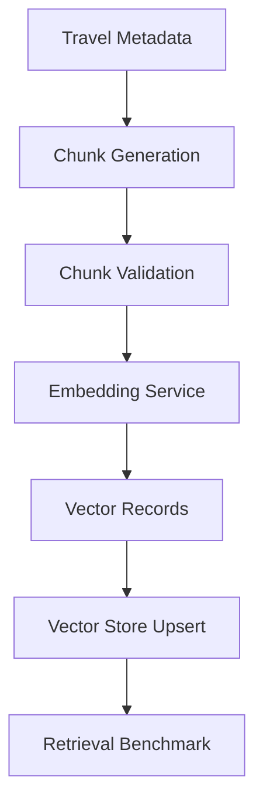

# Embedding Pipeline

The embedding pipeline converts travel metadata into searchable vector records.

## Pipeline



## Current Public Implementation

| Layer | File |
| --- | --- |
| Chunk generation | `ai-engine/src/retrieval/chunking.js` |
| Embedding service | `ai-engine/src/retrieval/embeddingService.js` |
| Local vector store | `ai-engine/src/retrieval/localVectorStore.js` |
| pgvector adapter | `ai-engine/src/retrieval/pgvectorStore.js` |
| Retrieval pipeline | `ai-engine/src/retrieval/retrievalPipeline.js` |

## Embedding Provider Boundary

The public repo uses `local-hash` embeddings. This provider is deterministic, secret-free, and intended for development tests only.

Production should replace it with a private embedding provider behind the same service contract:

```text
embedText(text) -> number[]
embedChunks(chunks) -> chunks with embeddings
```

## Re-indexing Workflow

Run a local reindex:

```bash
npm run reindex:retrieval
```

Generate a local cache artifact:

```bash
npm run ingest:retrieval
```

The generated `.cache/` output is ignored by Git.

## Update Strategy

Embedding updates should be triggered when:

- place metadata changes
- chunking logic changes
- embedding model changes
- retrieval filters or scoring fields change

Each vector record stores:

- source id
- source type
- entity type
- chunk type
- metadata
- embedding model
- embedding dimensions
- update timestamp
