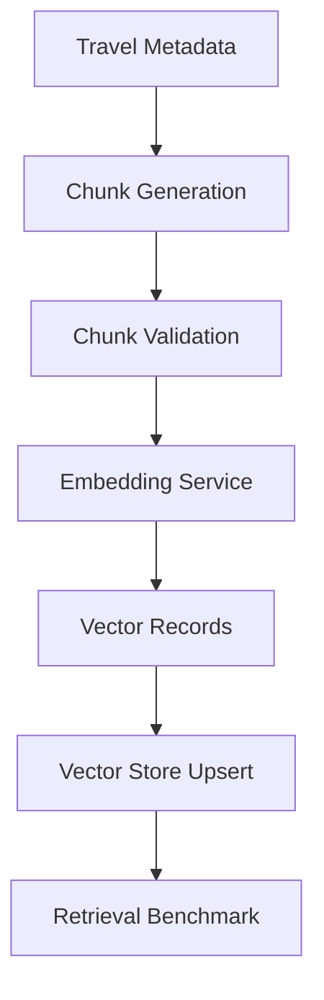

# Embedding Pipeline

The embedding pipeline converts travel metadata into searchable vector records.

## Pipeline


```mermaid
flowchart TD
  Places["Travel Metadata"] --> Chunks["Chunk Generation"]
  Chunks --> Validate["Chunk Validation"]
  Validate --> Embed["Embedding Service"]
  Embed --> Records["Vector Records"]
  Records --> Upsert["Vector Store Upsert"]
  Upsert --> Benchmark["Retrieval Benchmark"]
```

## Current Public Implementation

| Layer | File |
| --- | --- |
| Chunk generation | `ai-engine/src/retrieval/chunking.js` |
| Embedding service | `ai-engine/src/retrieval/embeddingService.js` |
| Hybrid retrieval scoring | `ai-engine/src/retrieval/hybridScoring.js` |
| Local vector store | `ai-engine/src/retrieval/localVectorStore.js` |
| Qdrant adapter | `ai-engine/src/retrieval/qdrantStore.js` |
| pgvector adapter | `ai-engine/src/retrieval/pgvectorStore.js` |
| Retrieval pipeline | `ai-engine/src/retrieval/retrievalPipeline.js` |
| Enriched place dataset | `ai-engine/src/datasets/enrichedPlaces.js` |
| Retrieval eval prompts | `ai-engine/src/retrieval/retrievalEvaluationPrompts.js` |

## Embedding Provider Boundary

The public repo uses `local-hash` embeddings. This provider is deterministic, secret-free, and intended for development tests only.

Production retrieval should use the BGE Small provider through Transformers.js:

```text
provider: transformers-js
model: Xenova/bge-small-en-v1.5
dimensions: 384
```

The provider stays behind the same service contract:

```text
embedText(text) -> number[]
embedChunks(chunks) -> chunks with embeddings
```

Qdrant indexing defaults to BGE Small unless `WAYFINDER_EMBEDDING_PROVIDER` is explicitly set. Local tests keep `local-hash` so they run without model downloads.

## Re-indexing Workflow

Run a local reindex:

```bash
npm run reindex:retrieval
```

Index into Qdrant:

```bash
QDRANT_URL=http://localhost:6333 npm run qdrant:index
```

For production-like local indexing, install optional model runtime dependencies first:

```bash
npm install
QDRANT_URL=http://localhost:6333 npm run qdrant:index
```

Generate a local cache artifact:

```bash
npm run ingest:retrieval
```

The generated `.cache/` output is ignored by Git.

## Update Strategy

Embedding updates should be triggered when:

- place metadata changes
- chunking logic changes
- embedding model changes
- retrieval filters or scoring fields change

The enriched place metadata now includes:

- category
- mood
- ideal traveler groups
- budget level
- best months
- visit duration
- crowd level
- walking effort
- family friendliness
- nightlife, adventure, and cultural scores

Each vector record stores:

- source id
- source type
- entity type
- chunk type
- metadata
- embedding model
- embedding dimensions
- update timestamp

## Hybrid Retrieval

WayFinder retrieval now combines:

- semantic vector score
- metadata score from category, mood, budget, month, crowd, walking, family, nightlife, adventure, and culture fields
- keyword score for explicit user terms

Each result includes a `retrievalBreakdown` and `retrievalReasons` array for debugging and product explanations.
