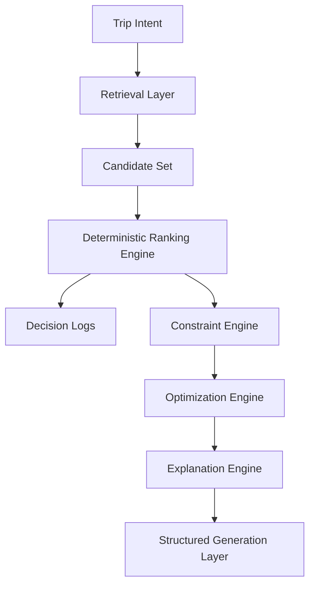

# Intelligence Flow Engine

Priority 2 changes WayFinder from an itinerary generator into a decision engine.

The core rule is simple:

```text
Retrieval finds candidates.
Ranking makes decisions.
Optimization improves the plan.
Generation structures and explains the result.
```

The LLM should not act as the ranking engine, optimizer, routing engine, or budget calculator.

## Current Flow



## Ranking Dimensions

| Dimension | Purpose |
| --- | --- |
| `semanticRelevance` | Measures fit against trip interests and semantic tags |
| `retrievalConfidence` | Uses retrieval score as a candidate-quality signal |
| `travelEfficiency` | Favors smoother clusters and lower travel-time friction |
| `popularity` | Adds public-safe demand/recognition signal |
| `budgetFit` | Scores activity cost against per-day budget capacity |
| `timingFit` | Checks whether a place fits the requested time window |
| `preferenceFit` | Applies learned food, heritage, recovery, and fatigue preferences |
| `groupCompatibility` | Checks whether the place fits solo/couple/friends/family context |
| `weatherCompatibility` | Scores indoor/outdoor resilience against weather constraints |
| `diversityFit` | Preserves activity variety across itinerary candidates |

## Decision Logging

Every ranking run returns a decision log with:

- intent summary
- scoring weights
- candidate score breakdowns
- strengths
- risks
- public-safe notes

This gives WayFinder a debugging and explainability trail before any LLM narration is added.

## Current Files

| Layer | File |
| --- | --- |
| Ranking engine | `ai-engine/src/intelligence/rankingEngine.js` |
| Decision logger | `ai-engine/src/intelligence/decisionLogger.js` |
| Retrieval-to-ranking pipeline | `ai-engine/src/intelligence/intelligencePipeline.js` |
| Demo | `ai-engine/examples/intelligenceFlowDemo.js` |
| Tests | `ai-engine/tests/intelligenceFlow.test.js` |

Run the demo:

```bash
npm run demo:intelligence
```

Run the tests:

```bash
npm run test:intelligence
```

## Next Priority 2 Steps

1. Route sequencing refinement
2. Adaptive recalculation
3. Optimization benchmarking expansion
4. Final structured itinerary generation

The current implementation now includes deterministic optimization and decision-quality evaluation, while still keeping final LLM generation downstream.
