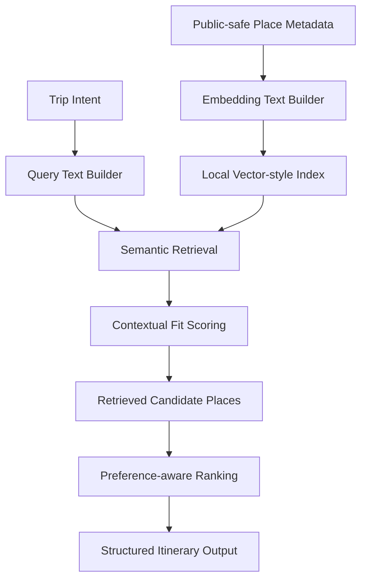

# Retrieval Layer

The Week 4 AI/ML milestone turns public-safe place metadata into a retrieval-ready system.

This repo uses a lightweight local retrieval index so the architecture is easy to read and run without external services. Production vector storage, private embeddings, proprietary place intelligence, and vendor-specific orchestration are intentionally excluded.

## Public Retrieval Flow



## Retrieval Inputs

| Input | Purpose |
| --- | --- |
| `query` | Free-text trip intent such as pace, mood, and priorities |
| `interests` | Structured interests like `heritage`, `food`, or `photography` |
| `constraints.pace` | Helps identify slow, balanced, or dense plans |
| `constraints.energyLevel` | Helps retrieve recovery-friendly or high-energy places |
| `constraints.timeOfDay` | Matches places to useful day windows |
| `constraints.weather` | Supports indoor or weather-resilient candidates |
| `constraints.groupType` | Preserves room for group-aware retrieval signals |

## Retrieval Outputs

Each retrieved place includes:

- `retrievalScore`
- `retrievalBreakdown.semanticScore`
- `retrievalBreakdown.contextScore`
- `retrievalReason`

The ranker can then score only the retrieved candidate set instead of the full place list.

## Public-Safe Implementation

Current files:

- `ai-engine/src/retrievalIndex.js`
- `ai-engine/examples/retrievalDemo.js`
- `ai-engine/src/samplePlaces.js`

Run the demo:

```bash
npm run demo:retrieval
```

Run contextual retrieval checks:

```bash
npm run test:retrieval
```

## Production Boundary

The public demo does not include:

- Private Jaipur place intelligence
- Real embedding provider calls
- Production vector DB credentials or schemas
- Proprietary retrieval tuning rules
- Internal evaluation traces
- Vendor prompt or orchestration internals

The goal is to show the shape of the retrieval layer without exposing private IP.
