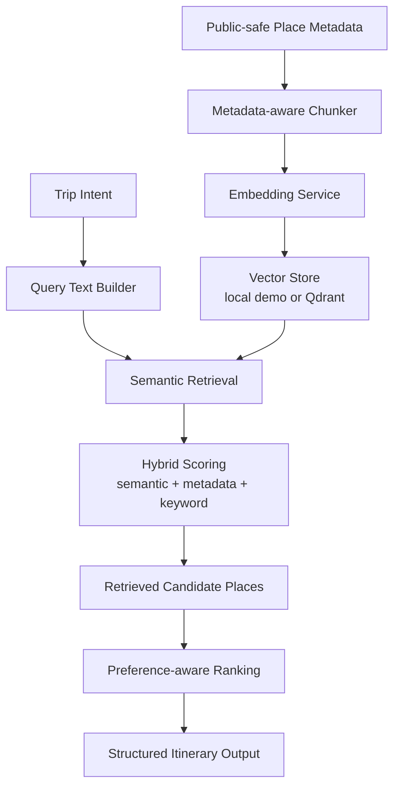

# Retrieval Layer

The retrieval layer turns public-safe place metadata into semantic search context for trip planning.

This repo now contains a production-facing retrieval foundation with a runnable local store and a Qdrant adapter. The local store keeps public tests and demos secret-free. Qdrant is the selected vector database path for the WayFinder place-intelligence layer.

## Public Retrieval Flow


```mermaid
flowchart TD
  Intent["Trip Intent"] --> Query["Query Text Builder"]
  Metadata["Public-safe Place Metadata"] --> Chunker["Metadata-aware Chunker"]
  Chunker --> Embed["Embedding Service"]
  Embed --> Index["Vector Store<br/>local demo or Qdrant"]
  Query --> Search["Semantic Retrieval"]
  Index --> Search
  Search --> Context["Hybrid Scoring<br/>semantic + metadata + keyword"]
  Context --> Candidates["Retrieved Candidate Places"]
  Candidates --> Ranking["Preference-aware Ranking"]
  Ranking --> Itinerary["Structured Itinerary Output"]
```

## Retrieval Inputs

| Input | Purpose |
| --- | --- |
| `query` | Free-text trip intent such as pace, mood, and priorities |
| `interests` | Structured interests like `heritage`, `food`, or `photography` |
| `constraints.pace` | Helps identify slow, balanced, or dense plans |
| `constraints.energyLevel` | Helps retrieve recovery-friendly or high-energy places |
| `constraints.timeOfDay` | Matches places to useful day windows |
| `constraints.weather` | Supports indoor or weather-resilient candidates |
| `constraints.groupType` | Preserves room for group-aware retrieval signals |
| `constraints.budgetBand` | Supports budget, moderate, and premium travel intent |
| `constraints.crowdLevel` | Helps retrieve quieter or busier places |
| `constraints.season` | Preserves seasonal travel signals such as winter |

## Retrieval Outputs

Each retrieved place includes:

- `retrievalScore`
- `retrievalBreakdown.semanticScore`
- `retrievalBreakdown.metadataScore`
- `retrievalBreakdown.keywordScore`
- `retrievalReasons`
- `retrievalReason`

The ranker can then score only the retrieved candidate set instead of the full place list.

## Public-Safe Implementation

Current files:

- `ai-engine/src/retrievalIndex.js`
- `ai-engine/src/retrieval/chunking.js`
- `ai-engine/src/retrieval/embeddingService.js`
- `ai-engine/src/retrieval/hybridScoring.js`
- `ai-engine/src/retrieval/localVectorStore.js`
- `ai-engine/src/retrieval/qdrantStore.js`
- `ai-engine/src/retrieval/retrievalPipeline.js`
- `ai-engine/src/retrieval/retrievalBenchmark.js`
- `ai-engine/src/retrieval/retrievalEvaluationPrompts.js`
- `ai-engine/examples/retrievalDemo.js`
- `ai-engine/src/datasets/enrichedPlaces.js`
- `ai-engine/src/samplePlaces.js`

Run the demo:

```bash
npm run demo:retrieval
```

Run contextual retrieval checks:

```bash
npm run test:retrieval
```

Run retrieval benchmarks:

```bash
npm run benchmark:retrieval
```

Run a local reindex:

```bash
npm run reindex:retrieval
```

Index into Qdrant:

```bash
QDRANT_URL=http://localhost:6333 npm run qdrant:index
```

The benchmark prompt set contains 100 retrieval prompts across romantic trips, family vacations, budget backpacking, hidden gems, nature-focused travel, adventure trips, beach intent, nightlife, heritage, low-energy plans, food/market walks, wildlife, solo wellness, premium couples trips, weekend city breaks, and winter travel.

The latest local benchmark target is above 90% minimum-hit pass rate on the 100-prompt set.

## Production Boundary

The public demo does not include:

- Private Jaipur place intelligence
- Real embedding provider calls
- Production vector DB credentials
- Proprietary retrieval tuning rules
- Internal evaluation traces
- Vendor prompt or orchestration internals

The goal is to show the shape of the retrieval layer without exposing private IP.
