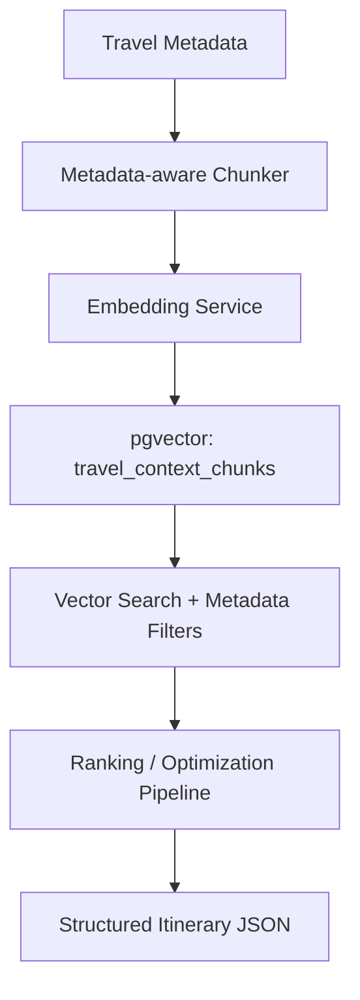

# Vector Database Selection

## Decision

WayFinder-Labs selects **pgvector on PostgreSQL** as the primary production vector storage path for the current MVP phase.

This keeps retrieval close to the existing backend data model, supports transactional updates with travel metadata, and avoids introducing a separate managed vector service before the team has enough scale data to justify it.

## Options Evaluated

| Option | Strengths | Tradeoffs | Fit |
| --- | --- | --- | --- |
| pgvector | Runs inside PostgreSQL, supports vector similarity search, HNSW/IVFFlat indexing, metadata joins, and one operational database for MVP data | Requires Postgres tuning and migration discipline as volume grows | Selected |
| Pinecone | Managed vector database, serverless indexes, metadata filtering, strong hosted operations story | Adds external vendor dependency and separate data lifecycle | Future managed-scale option |
| Weaviate | Full vector database with vector, keyword, hybrid search, filters, and schema-first modeling | More infrastructure surface area than the MVP needs right now | Future hybrid-search option |
| Qdrant | Dedicated vector database with collections, payload metadata, filtering, and official clients | Separate service to deploy and operate | Good standalone alternative |

## Selection Rationale

pgvector is the best current fit because WayFinder already expects a PostgreSQL-backed product architecture. Travel retrieval needs strong metadata filtering by destination, entity type, cluster, cost band, day window, and place role. Keeping vectors and relational metadata together reduces sync complexity during early product development.

## Integration Architecture



## Storage Target

Production table:

```text
travel_context_chunks
```

Schema:

```text
ai-engine/database/pgvector-schema.sql
```

The public demo uses 64-dimensional local hash embeddings so tests run without secrets. Production can switch the embedding dimensions in the schema and provider configuration.

## Source Links

- [pgvector official repository](https://github.com/pgvector/pgvector)
- [Pinecone serverless index docs](https://docs.pinecone.io/docs/create-an-index)
- [Weaviate vector search docs](https://docs.weaviate.io/weaviate/concepts/search/vector-search)
- [Qdrant collections docs](https://qdrant.tech/documentation/concepts/collections/)
