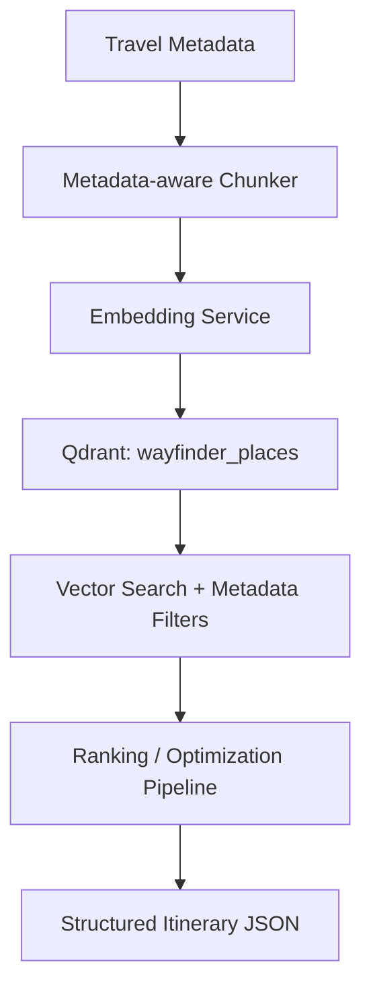

# Vector Database Selection

## Decision

WayFinder selects **Qdrant** as the primary vector database path for the place-intelligence retrieval layer.

The key product requirement is high-quality semantic retrieval over enriched destination metadata. Qdrant gives WayFinder a dedicated vector search service with payload filtering, collection-level ownership, and a path from local/self-hosted development to managed production without tying retrieval to the transactional product database.

## Options Evaluated

| Option | Strengths | Tradeoffs | Fit |
| --- | --- | --- | --- |
| Qdrant | Dedicated vector database with collections, payload metadata, filtering, local/self-hosted deployment, and managed options later | Separate service to deploy and operate | Selected |
| Pinecone | Managed vector database, serverless indexes, metadata filtering, strong hosted operations story | Adds external vendor dependency and separate data lifecycle | Easy hosted option |
| Weaviate | Full vector database with vector, keyword, hybrid search, filters, and schema-first modeling | More infrastructure surface area than the MVP needs right now | Future hybrid-search option |
| pgvector | Runs inside PostgreSQL, supports vector similarity search, HNSW/IVFFlat indexing, metadata joins, and one operational database for MVP data | Couples retrieval scale/tuning to the product database | Useful fallback |

## Selection Rationale

Qdrant is the best current fit because WayFinder's retrieval layer is becoming a product surface of its own. Places need embeddings plus payload filters for category, mood, budget, best months, crowd level, walking effort, group fit, family friendliness, nightlife, adventure, and culture. Keeping this in a dedicated vector service makes indexing, evaluation, and future self-hosting cleaner.

## Integration Architecture


```mermaid
flowchart TD
  Metadata["Travel Metadata"] --> Chunker["Metadata-aware Chunker"]
  Chunker --> Embeddings["Embedding Service"]
  Embeddings --> Store["Qdrant: wayfinder_places"]
  Store --> Search["Vector Search + Metadata Filters"]
  Search --> Ranker["Ranking / Optimization Pipeline"]
  Ranker --> Itinerary["Structured Itinerary JSON"]
```

## Storage Target

Production collection:

```text
wayfinder_places
```

Public implementation:

```text
ai-engine/src/retrieval/qdrantStore.js
```

The public demo uses 64-dimensional local hash embeddings so tests run without secrets. Production Qdrant indexing should use `Xenova/bge-small-en-v1.5` through Transformers.js with 384-dimensional vectors.

Local development still has a deterministic in-memory store for tests:

```text
ai-engine/src/retrieval/localVectorStore.js
```

## Source Links

- [Qdrant collections docs](https://qdrant.tech/documentation/concepts/collections/)
- [Qdrant filtering docs](https://qdrant.tech/documentation/concepts/filtering/)
- [Pinecone serverless index docs](https://docs.pinecone.io/docs/create-an-index)
- [Weaviate vector search docs](https://docs.weaviate.io/weaviate/concepts/search/vector-search)
- [pgvector official repository](https://github.com/pgvector/pgvector)
